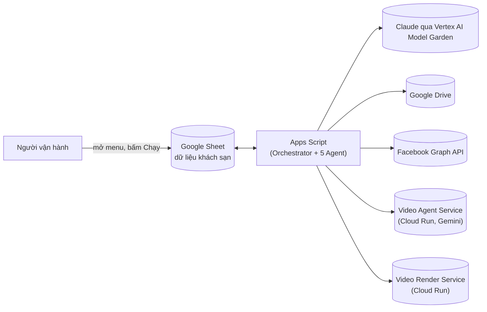
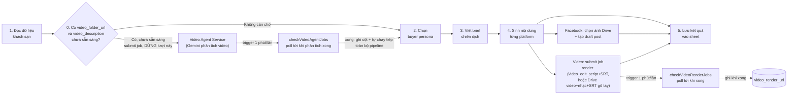

# Kiến trúc tổng quan — Hotel Marketing Automation (Google Apps Script)

Dự án là 1 Google Apps Script gắn với Google Sheet, chạy pipeline 5 "agent" tuần tự cho mỗi dòng khách sạn: đọc dữ liệu → chọn persona → viết brief → sinh nội dung từng platform (**Facebook**, **Zalo**) → (nếu là Facebook) tạo draft post kèm ảnh Drive, đồng thời (nếu có video) gửi job ghép phụ đề/nhạc nền cho 1 service render ngoài → ghi kết quả lại sheet.

Chỉ 2 platform sinh nội dung: **Facebook** (sinh nội dung + tự tạo draft post kèm ảnh) và **Zalo** (chỉ sinh nội dung, lưu vào cột `zalo_copy` để người vận hành tự đăng tay — không có bước gọi API đăng bài như Facebook). Các platform khác (Twitter, LinkedIn, Instagram) đã được gỡ khỏi pipeline; xem [Rules & Skills linh động](#rules--skills-linh-động-không-hard-code) để biết cách thêm lại 1 platform content-only (giống Zalo) mà không cần sửa code.

## Sơ đồ tổng quan (system context)

6 thành phần: **Sheet** (nơi chứa dữ liệu + là UI để bấm chạy), **Apps Script** (toàn bộ logic), và 4 dịch vụ ngoài mà script gọi tới: Claude (sinh nội dung), Drive (lấy ảnh/video/nhạc), Facebook (đăng draft), Video Agent Service (phân tích video khách sạn qua Gemini, sinh mô tả + SRT + kịch bản cắt), Video Render Service (ghép phụ đề + nhạc nền vào video). Chi tiết Video Agent Service ở [PLAN_video_agent_draft.md](PLAN_video_agent_draft.md) và [video-agent-service/ARCHITECTURE.md](video-agent-service/ARCHITECTURE.md).

## Sơ đồ pipeline xử lý 1 dòng khách sạn

Bước 1-4 lần lượt gọi Claude (bước 2-4). Nhánh phụ "Facebook" **không bao giờ chặn bước 5** — nếu lỗi (thư mục Drive sai, hết ảnh, token hỏng...) chỉ ghi vào cột trạng thái riêng (`fb_post_status`), persona/brief/nội dung vẫn được lưu và dòng vẫn `done` bình thường. Nhánh "Video" (submit job Render ở bước cuối) cũng never-throw tương tự.

**Bước 0 (gate, `gateVideoAgentStep_` trong `VideoAgentClient.gs`) là ngoại lệ duy nhất CÓ chặn**, vì lý do dữ liệu: khi hotel dùng `video_folder_url`, `video_description` do Gemini phân tích video sinh ra là nguồn mô tả **duy nhất đáng tin cậy** — input sheet chỉ chắc chắn có tên khách sạn + giá, các cột thủ công khác (`destination`, `giai_doan`, `benefits_raw`, `booking_note`) có thể hoàn toàn trống. Nếu để Agent 2-4 chạy trước khi có `video_description`, Claude không có đủ dữ liệu để viết nội dung có ý nghĩa. Vì vậy:
- Có `video_folder_url` và `video_description` **chưa sẵn sàng** (chưa từng submit, hoặc job đang `submitted`/`processing`): submit job (nếu chưa) sang Video Agent Service rồi **dừng lại ngay** — không chạy Agent 2-5, không set `status='done'` trong lượt đó. `checkVideoAgentJobs` (trigger 1 phút/lần) khi phát hiện job `succeeded` sẽ ghi `video_description`/`video_summary`/`video_srt`/`video_edit_script` vào sheet **và tự chạy tiếp toàn bộ phần còn lại của pipeline** (Agent2→3→4→Facebook→submit Render→Agent5) cho đúng dòng đó — không cần người vận hành bấm lại.
- Có `video_folder_url` nhưng `video_description` **đã sẵn sàng** (Video Agent chạy xong từ trước, hoặc job lỗi/bị bỏ qua, hoặc gõ tay), **hoặc không có `video_folder_url`:** không gate, chạy Agent 2-5 ngay bằng dữ liệu đang có. Bước "Video" ở cuối (submit job Render) dùng `video_srt`/`video_edit_script` nếu có `video_folder_url`, hoặc luồng thủ công cũ `video_drive_url`+`video_subtitle_srt` nếu không — chỉ submit job, không chờ render xong (vì có thể mất lâu hơn 6 phút), kết quả (`video_render_url`) có sau khi `checkVideoRenderJobs` poll xong.

Chi tiết đầy đủ (bao gồm lý do gate, state machine từng nhánh) xem [PLAN_video_agent_draft.md](PLAN_video_agent_draft.md).

Toàn bộ pipeline được `Orchestrator.gs` lặp qua từng dòng trong sheet, có giới hạn thời gian mỗi lần chạy (để tránh vượt quá 6 phút Apps Script cho phép) và tự đặt lịch chạy tiếp nếu chưa xử lý hết.

## Vai trò từng file

| File | Vai trò |
|---|---|
| `Orchestrator.gs` | Menu, điều phối toàn bộ pipeline, time-budget (`MAX_RUNTIME_MS`) + tự đặt trigger chạy tiếp nếu chưa xong hết dòng |
| `Agent1_ReadHotels.gs` | Đọc toàn bộ dòng khách sạn từ sheet, bỏ qua dòng đã `status = done` |
| `Agent2_BuyerPersona.gs` | Gọi Claude chọn 1 buyer persona phù hợp cho khách sạn |
| `Agent3_CampaignBrief.gs` | Gọi Claude viết brief chiến dịch dựa trên persona đã chọn |
| `Agent4_PlatformContent.gs` | Gọi Claude sinh nội dung riêng cho từng platform (facebook/zalo); skill viết cho từng platform đọc linh động từ sheet "Rules" qua `Rules.gs`, không hard-code |
| `Agent5_SaveResults.gs` | Ghi toàn bộ kết quả (persona, brief, nội dung platform, kết quả Facebook draft, status) trở lại sheet |
| `Rules.gs` | Đọc/seed sheet "Rules": nơi cấu hình linh động skill viết nội dung theo platform + rule bổ sung cho bước chọn persona/viết brief, không cần sửa code |
| `ClaudeClient.gs` | Wrapper gọi Claude qua Vertex AI Model Garden (JWT bearer flow bằng service account, tự cache access token), retry khi 429/5xx |
| `DriveImagePicker.gs` | Đọc thư mục Google Drive từ link, chọn ngẫu nhiên 5-10 ảnh (thuần Drive, không biết gì về Facebook) |
| `FacebookClient.gs` | Wrapper gọi Facebook Graph API: upload ảnh chưa publish, tạo draft post (`unpublished_content_type: DRAFT`), retry, dọn ảnh mồ côi, và hàm điều phối never-throw nối Drive + Facebook |
| `VideoRenderClient.gs` | Wrapper gọi Video Render Service (Cloud Run) ngoài: submit job ghép phụ đề+nhạc+cắt clip vào video (`video_folder_url` + `clips`=`video_edit_script` + `video_srt` + `music_drive_url`, gửi dạng `application/x-www-form-urlencoded` — không upload blob), quản lý trigger poll định kỳ, hàm điều phối never-throw khi submit |
| `VideoAgentClient.gs` | Wrapper gọi Video Agent Service (Cloud Run, Gemini) ngoài: submit job phân tích toàn bộ video trong 1 thư mục Drive, quản lý trigger poll định kỳ; `gateVideoAgentStep_` (never-throw) chặn đầu `processHotelRow_` khi `video_description` chưa sẵn sàng; khi job xong, `checkVideoAgentJobs` tự ghi kết quả vào sheet **và** gọi tiếp `runRestOfPipelineForRow_` (Agent2-5) cho đúng dòng đó |
| `Config.gs` | Đọc cấu hình từ Script Properties (Vertex AI project/service account/model, tên sheet, danh sách platform, Facebook Page ID/token, Video Render API token, Video Agent API token) |
| `Setup.gs` | Menu nhập/lưu cấu hình Vertex AI (Claude), Facebook Page ID/token, Video Render API token, Video Agent API token; test kết nối Facebook/Vertex AI |
| `Utils.gs` | Helper chung: tự thêm cột thiếu vào sheet (`ensureColumns_`), lấy tên khách sạn, dựng khối mô tả khách sạn cho prompt Claude ưu tiên `video_description` (`buildHotelContextText_`) |
| `appsscript.json` | Cấu hình runtime Apps Script (timezone, V8) |

## Dữ liệu trên sheet

**Input (người dùng tự điền):**
- Các cột thông tin khách sạn tuỳ ý, hoặc theo cấu trúc chuẩn `ten_ks`/`gia`/`destination`/`giai_doan`/`benefits_raw`/`booking_note` (khớp đúng field mà Video Agent Service cũng dùng) — toàn bộ được đưa vào Claude làm ngữ cảnh qua `buildHotelContextText_` (`Utils.gs`).
- `drive_folder_url` — link đầy đủ thư mục Drive ảnh của khách sạn đó (bắt buộc nếu muốn có bước đăng Facebook).
- `video_folder_url` — link thư mục Drive chứa nhiều video của khách sạn. Bắt buộc để dùng cả 2 bước Video Agent (phân tích video sinh mô tả/SRT/kịch bản cắt) **và** Video Render (Video Render Service giờ tự đọc video nguồn từ thư mục này, không nhận upload 1 file nữa).
- `music_drive_url` — link Drive tới 1 file nhạc nền cụ thể (tuỳ chọn), gửi làm `music_url` khi submit job Render.
- `video_drive_url`, `video_subtitle_srt` — **luồng thủ công cũ, KHÔNG còn được Video Render Service hỗ trợ** (API mới không nhận upload blob 1 file video nữa). Hotel nào đang dùng 2 cột này cần chuyển sang `video_folder_url`; nếu không, `video_render_status` sẽ báo `error: video_drive_url không còn được hỗ trợ...`.

**Output (tự tạo cột + tự điền khi chạy):**
- `buyer_persona`, `persona_reason`, `persona_tone`, `campaign_brief`
- `facebook_copy`, `zalo_copy`
- `fb_post_status` (`draft_created (N ảnh)` / `skipped: ...` / `error: ...`), `fb_post_id`, `fb_post_at`
- `video_description`, `video_summary`, `video_srt`, `video_edit_script` — do Video Agent Service sinh (Gemini phân tích video)
- `video_agent_status` (`skipped: no_video` → `submitted` → `succeeded`/`error: ...`), `video_agent_job_id`, `video_agent_at`
- `video_render_status` (`submitted` → `processing` → `done`/`error: ...`), `video_render_job_id`, `video_render_url`, `video_render_at`
- `status` (`done` / `error: ...`), `last_run_at`

Zalo **không** có cột `zalo_post_status`/`zalo_post_id` vì không có bước gọi API đăng bài — `zalo_copy` là nội dung cuối cùng, người vận hành tự copy sang Zalo OA (đăng tay hoặc dán vào công cụ lên lịch riêng).

## Rules & Skills linh động (không hard-code)

Trước đây chỉ dẫn viết nội dung theo từng platform (`PLATFORM_INSTRUCTIONS_`) nằm cứng trong `Agent4_PlatformContent.gs` — muốn đổi văn phong hay thêm platform phải sửa code rồi deploy lại. Giờ toàn bộ chỉ dẫn này được đọc từ 1 sheet tên **"Rules"** (tự tạo + tự seed dữ liệu mẫu khi chạy lần đầu, xem `Rules.gs`), người vận hành sửa trực tiếp trên Sheet mà không cần biết code:

| scope | target | rule_text | enabled |
|---|---|---|---|
| `platform` | `facebook` | chỉ dẫn viết bài Facebook | `TRUE` |
| `platform` | `zalo` | chỉ dẫn viết bài Zalo | `TRUE` |
| `persona` | *(để trống)* | chỉ dẫn bổ sung khi Agent 2 chọn buyer persona | `TRUE` |
| `brief` | *(để trống)* | chỉ dẫn bổ sung khi Agent 3 viết campaign brief | `TRUE` |

Quy tắc:
- Mỗi platform có thể có nhiều dòng `scope=platform` cùng `target`; tất cả dòng `enabled=TRUE` được nối lại theo thứ tự trên sheet thành 1 khối chỉ dẫn — muốn tắt tạm 1 rule chỉ cần sửa `enabled=FALSE`, không cần xoá dòng.
- **Thêm platform mới** (ví dụ TikTok): thêm tên platform vào Script Property `PLATFORMS`, rồi thêm dòng `scope=platform, target=tiktok, rule_text=<chỉ dẫn>` trong sheet Rules — không cần sửa code. Agent 5 tự tạo cột `<platform>_copy` và ghi kết quả (giống Zalo hiện tại: content-only, không tự động đăng).
- `scope=persona`/`scope=brief` là chỉ dẫn tuỳ chọn, được nối thêm vào system prompt của Agent 2/Agent 3 — để trống nếu không cần.
- Menu "🤖 AI Marketing" > "Mở sheet Rules & Skills" để mở nhanh sheet này.

## Script Properties (cấu hình, không hard-code trong code)

| Key | Ý nghĩa | Mặc định |
|---|---|---|
| `VERTEX_PROJECT_ID` | GCP Project ID chứa Vertex AI (Claude Model Garden) | *(bắt buộc, không có default)* |
| `VERTEX_SA_KEY_JSON` | JSON key (1 dòng) của service account gọi Vertex AI | *(bắt buộc, không có default)* |
| `VERTEX_REGION` | Region Vertex AI | `us-east5` |
| `CLAUDE_VERTEX_MODEL` | Model ID Claude trên Vertex AI Model Garden | `claude-sonnet-4-5` |
| `SHEET_NAME` | Tên sheet chứa dữ liệu khách sạn | `Sheet1` |
| `PLATFORMS` | Danh sách platform sinh nội dung, phân tách bởi dấu phẩy | `facebook,zalo` |
| `RULES_SHEET_NAME` | Tên sheet chứa Rules & Skills linh động | `Rules` |
| `FB_PAGE_ID` | ID fanpage dùng chung cho mọi khách sạn | *(bắt buộc để dùng tính năng Facebook)* |
| `FB_PAGE_ACCESS_TOKEN` | Long-lived Page Access Token | *(bắt buộc để dùng tính năng Facebook)* |
| `VIDEO_RENDER_API_TOKEN` | Bearer token của Video Render Service (Cloud Run) | *(bắt buộc để dùng tính năng render video)* |
| `VIDEO_AGENT_API_TOKEN` | Bearer token của Video Agent Service (Cloud Run) | *(bắt buộc để dùng tính năng phân tích video qua Gemini)* |

> [!NOTE]
> Claude được gọi hoàn toàn qua **Vertex AI Model Garden** (billing dồn về GCP) — không còn
> dùng Anthropic API key trực tiếp. Chi tiết/lý do xem
> [PLAN_vertex_ai_billing_draft.md](PLAN_vertex_ai_billing_draft.md).

Xem chi tiết hướng dẫn lấy `FB_PAGE_ID`/`FB_PAGE_ACCESS_TOKEN` trong [PLAN_facebook_drive_draft.md](PLAN_facebook_drive_draft.md), chi tiết flow render video trong [PLAN_video_render_draft.md](PLAN_video_render_draft.md), và chi tiết flow phân tích video (Video Agent Service) trong [PLAN_video_agent_draft.md](PLAN_video_agent_draft.md).
