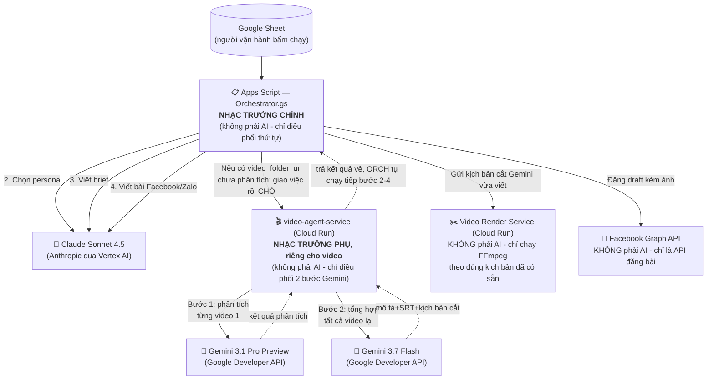

# Kiến trúc AI — Hệ thống đang dùng những AI nào, model nào, ai điều phối gì

> Tài liệu này trả lời đúng 1 câu hỏi: **trong toàn bộ hệ thống, có bao nhiêu AI, của ai, model gì, và ai đang "chỉ huy" ai.** Muốn hiểu cấu trúc file code, xem [ARCHITECTURE.md](ARCHITECTURE.md). Muốn biết cách vận hành hàng ngày, xem [HUONG_DAN_VAN_HANH.md](HUONG_DAN_VAN_HANH.md).

## Tóm tắt 1 bảng

| AI | Model | Nhà cung cấp | Ai gọi nó | Việc nó làm |
|---|---|---|---|---|
| 🤖 Claude | `claude-sonnet-4-5` | Anthropic (qua **Vertex AI Model Garden**, billing dồn về GCP) | Apps Script | Chọn buyer persona, viết campaign brief, viết nội dung đăng Facebook/Zalo |
| 🤖 Gemini (phân tích) | `gemini-3.1-pro-preview` | Google (**Gemini Developer API**) | `video-agent-service` (Cloud Run) | Xem từng video thô, mô tả cảnh, phát hiện chữ/logo cháy hình, tìm điểm bán hàng |
| 🤖 Gemini (tổng hợp) | `gemini-3.7-flash` | Google (**Gemini Developer API**) | `video-agent-service` (Cloud Run) | Gộp kết quả phân tích thành mô tả khách sạn + phụ đề (SRT) mới + kịch bản cắt/ghép video |

**Chỉ có đúng 2 AI, 3 model.** Mọi thứ khác trong hệ thống (đăng Facebook, ghép video, đọc/ghi Google Sheet, gọi Drive) đều **không phải AI** — là các đoạn code/dịch vụ xử lý máy móc thuần tuý, không "suy nghĩ".

## Sơ đồ: ai điều phối ai

## Giải thích từng AI

### 1. Claude Sonnet 4.5 — "Người viết nội dung marketing"

- **Model:** `claude-sonnet-4-5`, chạy qua **Vertex AI Model Garden** (không gọi thẳng Anthropic API) — lý do: khách hàng yêu cầu dồn toàn bộ billing về 1 hoá đơn GCP, không muốn trả tiền qua nhiều nơi khác nhau.
- **3 việc nó làm, theo đúng thứ tự (mỗi việc là 1 lần gọi Claude riêng):**
  1. **Chọn buyer persona** — dựa vào thông tin khách sạn (và mô tả từ video nếu có), chọn 1 kiểu khách hàng mục tiêu phù hợp nhất.
  2. **Viết campaign brief** — dựa vào persona vừa chọn, viết thông điệp chính, điểm bán hàng, tone giọng văn, CTA.
  3. **Viết nội dung từng nền tảng** (Facebook, Zalo) — dựa vào brief + persona + văn phong cấu hình trong sheet "Rules", viết bài hoàn chỉnh.
- Bước 1 và 2 chạy **âm thầm, không hiển thị trực tiếp cho khách** — chỉ là bước trung gian để bước 3 viết bài tốt hơn. Kết quả 2 bước này vẫn được lưu vào cột `buyer_persona`/`campaign_brief` để tham khảo/kiểm tra nếu cần.

### 2. Gemini 3.1 Pro Preview — "Người xem video"

- **Model:** `gemini-3.1-pro-preview`, gọi qua **Gemini Developer API** (dùng API key, KHÔNG qua Vertex AI).
- **Việc nó làm:** với **mỗi video thô** trong thư mục Drive của khách sạn, xem toàn bộ video và trả về: mô tả từng cảnh (scene), thời điểm bắt đầu/kết thúc mỗi cảnh, cảnh nào có chữ/logo cháy sẵn trên hình (để tránh chồng chữ khi ghép phụ đề mới), điểm bán hàng/cảm xúc nổi bật trong cảnh đó.
- Nếu khách sạn có 5 video, bước này chạy **5 lần** (1 lần/video), độc lập với nhau.

### 3. Gemini 3.7 Flash — "Người biên tập, viết kịch bản"

- **Model:** `gemini-3.7-flash`, cũng qua Gemini Developer API.
- **Việc nó làm:** nhận **toàn bộ** kết quả phân tích của tất cả video (từ bước Gemini Pro ở trên) + thông tin khách sạn (giá, khoảng ngày áp dụng, quyền lợi...) + văn phong cấu hình sẵn, rồi viết ra **1 lần duy nhất**:
  - `video_description` — mô tả tổng hợp cảm xúc/không gian khách sạn (dùng làm ngữ cảnh cho Claude viết bài Facebook/Zalo).
  - `video_summary` — tóm tắt ngắn.
  - `video_srt` — phụ đề (SRT) hoàn toàn mới cho video quảng cáo (khoảng 30-60 giây), không phải transcript gộp thô.
  - `video_edit_script` — danh sách chính xác từng đoạn cần cắt từ video nào, giây thứ mấy đến giây thứ mấy, để khớp với từng dòng phụ đề vừa viết.
- Đây là bước "sáng tạo" — quyết định video quảng cáo mới sẽ kể câu chuyện gì, cắt đoạn nào, theo đúng văn phong CHV.

### Vì sao 2 vai trò Gemini tách làm 2 model/2 bước riêng?

- **Phân tích** (Pro) cần xem kỹ từng video, phát hiện chi tiết chính xác (mốc thời gian, chữ cháy hình) → cần model mạnh hơn để hiểu hình ảnh/video chính xác.
- **Tổng hợp** (Flash) chỉ làm việc trên **văn bản** (kết quả phân tích ở dạng JSON, không xem lại video) → việc thuần viết lách, model nhanh/rẻ hơn vẫn đủ dùng.
- Tách 2 bước cũng giúp gọi song song nhiều video ở bước phân tích, rồi mới gộp lại 1 lần ở bước tổng hợp — nhanh hơn so với gộp toàn bộ vào 1 lần gọi khổng lồ.

## Vì sao Claude và Gemini lại gọi theo 2 cách khác nhau (Vertex AI vs Developer API)?

Cả 2 đều **cùng tính phí vào project GCP `bof-intern`** (đúng yêu cầu dồn 1 hoá đơn của khách hàng), nhưng đi qua 2 "cửa" kỹ thuật khác nhau:

- **Claude → Vertex AI Model Garden:** đây là cách chuẩn để dùng model của hãng khác (Anthropic) nhưng vẫn tính phí qua GCP.
- **Gemini → Developer API (không qua Vertex AI):** đáng lẽ Gemini (model của chính Google) dùng qua Vertex AI mới "thuần", nhưng tại thời điểm triển khai, các model Gemini 3.x **chưa được Google mở trên Vertex AI cho project này** (đã kiểm tra qua Cloud Quotas API, xác nhận không có quota nào tồn tại). Vì vậy phải dùng Gemini Developer API với 1 API key được tạo **gắn đúng project `bof-intern`** để billing vẫn về đúng 1 nơi. Chi tiết lý do/quá trình đổi qua lại xem [PLAN_vertex_ai_billing_draft.md](PLAN_vertex_ai_billing_draft.md).

## Những phần KHÔNG phải AI (dễ nhầm)

| Thành phần | Vì sao dễ nhầm là AI | Thực ra là gì |
|---|---|---|
| Video Render Service (Cloud Run) | Nó "tạo ra" video quảng cáo hoàn chỉnh | Chỉ chạy **FFmpeg** cắt/ghép/chèn phụ đề đúng theo `video_edit_script` mà Gemini đã viết sẵn — không tự quyết định gì, không "sáng tạo" |
| Facebook Graph API | Tự động tạo draft bài kèm ảnh | Chỉ là API đăng bài của Facebook, ảnh do `DriveImagePicker.gs` chọn **ngẫu nhiên** (không phải AI chọn) |
| Google Drive / Sheets API | Tự động đọc/ghi dữ liệu | Thuần thao tác đọc/ghi file, không xử lý ngôn ngữ/hình ảnh gì |

## Model đang dùng có thể đổi qua Script Properties / biến môi trường, không cần sửa code

| Model | Nơi cấu hình |
|---|---|
| Claude | Script Property `CLAUDE_VERTEX_MODEL` (Apps Script) |
| Gemini phân tích | Biến môi trường `GEMINI_ANALYSIS_MODEL` (Cloud Run `video-agent-service`) |
| Gemini tổng hợp | Biến môi trường `GEMINI_SYNTHESIS_MODEL` (Cloud Run `video-agent-service`) |
