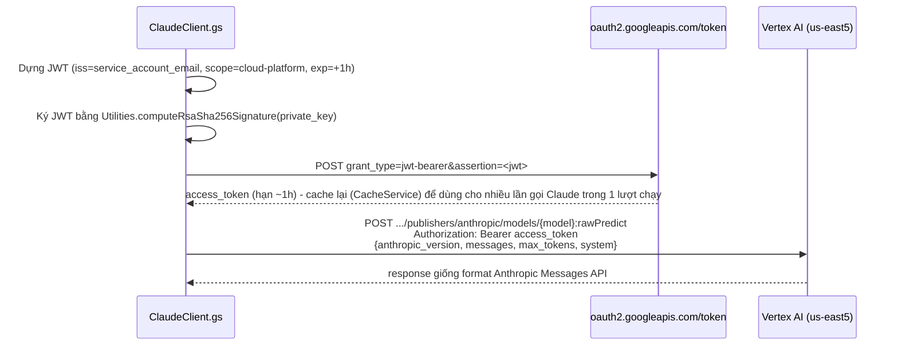

# Plan: Dồn billing Claude + Gemini về GCP (qua Vertex AI)

> [!NOTE]
> Lý do: khách hàng không muốn trả phí qua nhiều nơi (Anthropic Console riêng, Google AI
> Studio riêng, GCP riêng) — cần dồn hết về 1 hoá đơn GCP duy nhất.

## Đã kiểm chứng thực tế (không phải suy đoán)

> Cập nhật 2026-08-26: chuyển sang test trên project **`bof-intern`** (project THẬT đang chứa
> Cloud Run Video Render production — trùng project number `938843422997` với URL
> `video-render-service-938843422997...`), không dùng `gcp-learning-bachvx` (project học/test)
> nữa. Xem `GOLIVE.md` mục hạ tầng.

- `aiplatform.googleapis.com` (Vertex AI) đã enable sẵn trên `bof-intern`.
- Được cấp quyền qua group `AIintern@edu.gimasys.com` — role `roles/editor` (+ `datastore.owner`,
  `run.admin`) — đủ rộng để gọi Vertex AI, deploy Cloud Run, dùng Firestore.
- **Model ID chính xác của Claude Sonnet 5 trên Vertex AI: `claude-sonnet-5`** (version
  `claude-sonnet-5@default`) — lấy trực tiếp từ trang chi tiết model trong Model Garden Console,
  **không phải** `claude-sonnet-4-5@20250929` như đoán ban đầu (đó là model đời cũ hơn, vẫn tồn
  tại trong catalog nhưng không phải bản đang dùng).
- Sau khi enable model qua Console (Model Garden → Claude Sonnet 5), gọi thật
  `POST .../publishers/anthropic/models/claude-sonnet-5:rawPredict` trên `bof-intern`:
  - Region **`us-east5`** và **`us-central1`**: **pass auth + pass quyền truy cập model**, bị
    chặn bởi `429 RESOURCE_EXHAUSTED` — quota `online_prediction_input_tokens_per_minute_per_base_model`
    cho `anthropic-claude-sonnet-5` đang ở mức mặc định quá thấp (bình thường với project mới
    chưa từng dùng model này) → **cần xin tăng quota qua Console (IAM & Admin → Quotas), không
    có lệnh gcloud tương đương chắc chắn cho quota generative AI theo model**.
  - Region `global`: 404 — không dùng được, chỉ dùng `us-east5` hoặc `us-central1`.
- Request body dạng `{"anthropic_version": "vertex-2023-10-16", "messages": [...], "max_tokens": N}`
  được server chấp nhận đúng cấu trúc (không bị lỗi 400 sai format ở bất kỳ lần test nào) — xác
  nhận đúng schema cần dùng khi sửa `ClaudeClient.gs`.
- Auth dùng chuẩn OAuth Bearer access token của GCP (không phải `x-api-key` như Anthropic API
  trực tiếp) + cần header `x-goog-user-project` khi dùng access token dạng ADC.

---

## Phần A: Gemini (`video-agent-service`) → Vertex AI — ĐÃ THỬ, SAU ĐÓ ĐỔI LẠI (2026-08-26)

> [!WARNING]
> Toàn bộ mục này (Vertex AI cho Gemini) đã bị **đảo ngược trong cùng ngày** — xem mục
> "Cập nhật: đổi lại sang Developer API" ở cuối phần này để biết trạng thái CUỐI CÙNG đang chạy
> production. Giữ lại nội dung gốc bên dưới làm lịch sử quyết định (why), không phải hướng dẫn
> implement hiện tại.

> [!IMPORTANT]
> Ban đầu tưởng "đây là phần dễ, chỉ cần đổi cấu hình" — **sai**, thực tế kiểm chứng cho thấy 2
> phát hiện lớn khiến đây thành 1 thay đổi kiến trúc thật, không chỉ đổi config. Ghi lại chi tiết
> ở đây để không ai lặp lại giả định sai này.

### Đã kiểm chứng thực tế (test trên `bof-intern`, service account `video-agent-runtime`/`apps-script-vertex`)

1. **`client.files.upload()` (Gemini Files API) hoàn toàn KHÔNG hoạt động ở chế độ Vertex AI** —
   test thật trả về `ValueError: This method is only supported in the Gemini Developer client.`
   → bắt buộc phải đổi sang **GCS + `types.Part.from_uri()`** (bucket
   `bof-intern-video-agent-media`, region `asia-southeast1`) — không phải chuyện đổi 1 dòng config.
   Đã verify cơ chế mới này chạy đúng end-to-end bằng chính code thật (`gcs_client.upload_video`
   → `gemini_client.analyze_video` → `gcs_client.delete_video`), dùng credential chỉ có
   `roles/storage.objectViewer` (đọc) để xác nhận Gemini tự đọc được GCS mà không cần quyền ghi.
2. **`gemini-3.x` (Pro/Flash) tồn tại trên Vertex AI Model Garden nhưng project CHƯA được cấp
   quyền dùng** — mọi model 3.x (`gemini-3.7-flash`, `gemini-3.6-flash`, `gemini-3.5-flash`,
   `gemini-3.1-pro-preview`) đều trả `404 NOT_FOUND ... your project does not have access to it`
   dù `client.models.list()` vẫn liệt kê được — y hệt tình huống Claude, nhiều khả năng cần bấm
   "Enable" riêng trong Model Garden cho từng model. **`gemini-2.5-pro`/`gemini-2.5-flash` gọi
   được ngay, không cần enable gì thêm** (model đời cũ, chắc đã có sẵn cho mọi project).
3. **`gemini-3.x`/`gemini-2.5-*` KHÔNG có ở region `asia-southeast1`** qua Vertex AI (0 kết quả
   khi liệt kê) — chỉ có ở `us-central1`/`global`. Đã chọn `us-central1` làm
   `GEMINI_VERTEX_LOCATION` mặc định (GCS bucket vẫn đặt `asia-southeast1` cho gần Cloud Run,
   không liên quan tới region gọi Gemini).

### Quyết định: dùng `gemini-2.5-pro`/`gemini-2.5-flash` ngay, nâng cấp `gemini-3.x` sau
Theo yêu cầu người dùng (2026-08-26): code GCS + chuyển hẳn sang Vertex AI ngay bây giờ, dùng
model đang hoạt động thật (`gemini-2.5-pro` phân tích / `gemini-2.5-flash` tổng hợp — vẫn là
nâng cấp so với `gemini-2.5-flash` dùng cho cả 2 bước trước đây). Enable `gemini-3.x` trong Model
Garden làm song song, không block — xong thì chỉ cần đổi `GEMINI_ANALYSIS_MODEL`/
`GEMINI_SYNTHESIS_MODEL`, không cần sửa code.

### Code đã sửa
- `app/config.py`: xoá hẳn `gemini_api_key` (không giữ fallback, nhất quán với quyết định ở Claude).
  Thêm `gemini_analysis_model` (mặc định `gemini-2.5-pro`), `gemini_synthesis_model` (mặc định
  `gemini-2.5-flash`), `gemini_vertex_location` (mặc định `us-central1`), `gcs_bucket`.
- `app/gcs_client.py` (**file mới**): `upload_video()`/`delete_video()`.
- `app/gemini_client.py`:
  - `build_client()` → luôn `genai.Client(vertexai=True, project=..., location=...)`, không còn
    nhánh `api_key=`.
  - Xoá hẳn `_wait_until_active()`/`_upload_with_retry()` (Files-API-specific, không cần nữa —
    GCS object dùng được ngay, không cần chờ trạng thái ACTIVE như Files API).
  - `analyze_video()` đổi signature: nhận `gcs_uri, mime_type, video_name` thay vì `video_path,
    video_name`; dùng `types.Part.from_uri(file_uri=gcs_uri, mime_type=mime_type)`.
- `app/pipeline.py`: sau khi tải video từ Drive về temp file, gọi
  `gcs_client.upload_video()` lấy `gcs_uri` → `gemini_client.analyze_video()` → LUÔN
  `gcs_client.delete_video()` trong `finally` (dọn dẹp dù thành công hay lỗi).
- `requirements.txt`: thêm `google-cloud-storage`.

### Hạ tầng GCP đã tạo trên `bof-intern`
- Bucket `bof-intern-video-agent-media` (region `asia-southeast1`).
- Service account `video-agent-runtime@bof-intern.iam.gserviceaccount.com` — **đã tạo xong**
  (trước đó chỉ có trong plan, chưa từng chạy lệnh tạo thật). Đã gán `roles/storage.objectAdmin`
  trên bucket trên (cấp bucket, tự làm được, không cần admin).
- **Còn thiếu, cần admin `tdbao@gimasys.com` grant giúp** (quyền cấp PROJECT, role Editor của
  `AIintern` group cố tình không sửa được IAM — xem mục Claude ở trên): `roles/datastore.user`,
  `roles/secretmanager.secretAccessor`, `roles/cloudtasks.enqueuer`, `roles/aiplatform.user` cho
  `video-agent-runtime@bof-intern.iam.gserviceaccount.com`. → Admin đã grant xong sau đó, nhưng
  không còn dùng tới `aiplatform.user` nữa (xem bên dưới) - 3 role còn lại vẫn cần cho
  Firestore/Secret Manager/Cloud Tasks.

### Cập nhật (cùng ngày 2026-08-26): đổi lại sang Developer API — TRẠNG THÁI CUỐI CÙNG

Sau khi admin grant `roles/aiplatform.user` và enable model qua Model Garden Console (giống
Claude), test thật `gemini-3.x` trên Vertex AI **vẫn 404 "does not have access"**. Tra sâu qua
Cloud Quotas API (như đã làm với Claude Sonnet 5): **không có bất kỳ quota bucket nào** được tạo
cho `gemini-3-pro-preview`/`gemini-3.7-flash`/... ở bất kỳ metric nào (khác Claude Sonnet 5, nơi
quota bucket tồn tại nhưng =0) — dấu hiệu Gemini 3.x trên Vertex AI vẫn đang giới hạn
allowlist/EAP thật sự cho project này, không tự "Enable" là xong như Claude.

Trong lúc đó, `gemini-3.1-pro-preview`/`gemini-3.7-flash` **gọi được ngay** qua **Gemini Developer
API** (`generativelanguage.googleapis.com`, dùng API key thay vì Vertex AI). Phát hiện quan trọng
giải quyết mâu thuẫn với mục tiêu "dồn billing về GCP": theo tài liệu Google, *"The API key itself
is free; the bill belongs to the project and its linked Cloud Billing account"* — nếu tạo API key
gắn với đúng project GCP (chọn project lúc tạo key trong AI Studio, không phải tài khoản cá nhân),
usage vẫn tính vào đúng Cloud Billing Account đó, cùng hoá đơn với Cloud Run/Vertex AI Claude.
Vấn đề gốc không phải "Vertex AI vs API key", mà là "key có gắn đúng project/billing account hay
không".

**Phát hiện thêm, làm tăng tính cấp thiết:** Google đã lên lịch ngừng `gemini-2.5-pro`/
`gemini-2.5-flash`/`gemini-2.5-flash-lite` "không sớm hơn 16/10/2026" (ngày chính thức sẽ báo
trước 6 tháng khi Gemini 3 GA), tự liệt kê `gemini-3.1-pro-preview`/`gemini-3.6-flash` làm model
thay thế khuyến nghị.

**Quyết định cuối cùng (theo yêu cầu người dùng):**
- Đổi hẳn `gemini_client.build_client()` về `genai.Client(api_key=...)` (Developer API), **bỏ
  hoàn toàn Vertex AI cho Gemini** — không giữ fallback/toggle giữa 2 chế độ.
- Files API (`client.files.upload()`) hoạt động ở Developer API nhưng KHÔNG hoạt động ở Vertex AI;
  ngược lại `Part.from_uri(gs://...)` hoạt động ở Vertex AI nhưng KHÔNG hoạt động ở Developer API
  (lỗi thật: `400 Referencing Google Cloud Storage files directly is not supported. Register them
  using FileService.RegisterFile first.`) — 2 chế độ không tương thích chéo, nên khi đổi lại phải
  **revert hẳn cơ chế GCS**, quay về Files API gốc: xoá `app/gcs_client.py`, xoá bucket GCS khỏi
  luồng xử lý (bucket hạ tầng vẫn còn tồn tại trên `bof-intern`, không xoá, chỉ không dùng), xoá
  `google-cloud-storage` khỏi `requirements.txt`.
- `config.py`: thêm lại `gemini_api_key`, xoá `gemini_vertex_location`/`gcs_bucket`. Model đổi
  sang `gemini-3.1-pro-preview` (phân tích)/`gemini-3.7-flash` (tổng hợp).
- `GEMINI_API_KEY` mới đã tạo gắn với `bof-intern` (tên hiển thị "Key Video" trong Secret Manager
  project, xác nhận qua `gcloud services api-keys list`), lưu vào secret
  `video-agent-gemini-api-key` (đã có sẵn từ trước, chỉ thêm version mới).
- Đã test thật end-to-end với video hotel thật trên production — kết quả Gemini 3.1 Pro Preview
  cho văn phong giàu insight/cụ thể hơn rõ rệt so với bản Gemini 2.5 Pro (vd chi tiết "Không tiếng
  chuông báo thức. Không vội vã deadline." - insight hiện đại, đúng đối tượng, không sáo rỗng).

**Bài học rút ra:** không giả định "Vertex AI = luôn có mọi model", đặc biệt model preview/rất mới
— cần test thật bằng `generate_content` (không chỉ `models.list()`) trước khi thiết kế kiến trúc
xoay quanh 1 nền tảng cụ thể.

---

## Phần B: Claude (Apps Script `ClaudeClient.gs`) → Vertex AI Model Garden

**Đây là phần khó hơn**, vì Apps Script không có Application Default Credentials sẵn như Cloud
Run — phải tự làm 1 flow xác thực GCP riêng.

### Vì sao không dùng lại cách OAuth refresh token đã làm cho Drive?
Refresh token 3-chân (gắn với 1 tài khoản Google người dùng) hợp lý cho việc "đọc Drive của 1
người" — nhưng gọi Vertex AI là quan hệ "script gọi thẳng 1 API của GCP", đúng bản chất nên dùng
**Service Account** (danh tính máy-với-máy, không gắn với 1 người dùng cụ thể, không lo bị vô
hiệu nếu người đó đổi mật khẩu/nghỉ việc) — giống cách Cloud Run đang dùng service account
`video-agent-runtime`, chỉ khác là Apps Script phải tự ký JWT thủ công vì không có ADC.

### Cách hoạt động (JWT Bearer flow, chuẩn OAuth2 service account)

> [!TIP]
> Khuyến nghị dùng thư viện Apps Script có sẵn tên **"OAuth2 for Apps Script"** (thư viện chính
> thức của Google Workspace, tìm qua "Add a library" trong Apps Script editor bằng từ khoá
> "OAuth2") để làm bước ký JWT + cache token, thay vì tự viết `computeRsaSha256Signature` từ đầu
> — giảm rủi ro lỗi ký sai/token hết hạn không refresh đúng. Cần tìm đúng script ID lúc code
> (không chốt cứng ID trong plan này vì có thể đã đổi version).

### Cần làm (Console, chỉ làm 1 lần)
- [ ] **Bật Claude trong Vertex AI Model Garden cho project** (Console → Vertex AI → Model
      Garden → Anthropic Claude → Enable) — bước này **không thể làm qua gcloud/code**, đã xác
      nhận bằng test thật ở trên (404 "does not have access").
- [ ] Tạo 1 service account riêng (vd `apps-script-vertex@<project>.iam.gserviceaccount.com`),
      gán role `roles/aiplatform.user`.
- [ ] Tạo key JSON cho service account đó, **minify về 1 dòng** (vd
      `Get-Content key.json -Raw | ConvertFrom-Json | ConvertTo-Json -Compress`) trước khi lưu
      vào Script Properties (ô nhập của Apps Script không xử lý tốt JSON nhiều dòng).

### Cần sửa code — **đã code xong, đã bỏ hoàn toàn đường Anthropic API key** (quyết định
2026-08-26: dùng Vertex AI 100%, không giữ fallback)
- `Config.gs`: thêm `getVertexServiceAccountKey_()` (parse JSON đã lưu), `getVertexProjectId_()`,
  `getVertexRegion_()` (mặc định `us-east5`), `getClaudeVertexModel_()` (mặc định
  `claude-sonnet-4-5`, đã xác nhận model ID thật hoạt động). **Đã xoá hẳn**
  `getClaudeApiKey_()`, `getClaudeModel_()`, `DEFAULT_MODEL`, `isVertexBillingEnabled_()` (không
  còn nhánh rẽ, Vertex là đường duy nhất).
- `Setup.gs`: thêm `promptForVertexServiceAccount()` (dán JSON key đã minify) +
  `testVertexConnection()`, menu item mới. **Đã xoá hẳn** `promptForApiKey()`.
- `Orchestrator.gs`: **đã xoá** menu "Thiết lập API Key", thêm 2 menu Vertex AI.
- `ClaudeClient.gs`:
  - Thêm `getVertexAccessToken_()` — dựng + ký JWT, đổi lấy access token, cache bằng
    `CacheService.getScriptCache()` (~55 phút, thấp hơn hạn thật của token 1h).
  - `callClaude_(systemPrompt, userPrompt, maxTokens)` giờ **luôn** gọi endpoint Vertex
    (`https://{region}-aiplatform.googleapis.com/v1/projects/{project}/locations/{region}/publishers/anthropic/models/{model}:rawPredict`)
    với `Authorization: Bearer <access_token>` + body
    `{anthropic_version: "vertex-2023-10-16", system, messages, max_tokens}`. **Đã xoá hẳn**
    `callClaudeDirect_()`, `CLAUDE_ENDPOINT` (`api.anthropic.com`), header `x-api-key`. **Giữ
    nguyên signature hàm `callClaude_`** — Agent2/3/4 không cần sửa gì.
  - Đã verify logic JWT-signing đúng bằng cách mô phỏng lại thuật toán trong Node dùng key thật
    (xem mục checklist bước 5) — không chỉ syntax check.

---

## Việc KHÔNG đổi

- Toàn bộ Agent2/3/4/5, Orchestrator (ngoài menu), Rules.gs, Facebook/Video Render flow — không
  liên quan, không sửa.
- Cấu trúc Sheet — không đổi.

> [!IMPORTANT]
> Không còn giữ fallback `CLAUDE_API_KEY` nữa (quyết định 2026-08-26, khác với thiết kế ban đầu
> của phần này) — nếu chưa cấu hình `VERTEX_SA_KEY_JSON`/`VERTEX_PROJECT_ID`, `callClaude_()` sẽ
> throw lỗi rõ ràng ngay (qua `getVertexServiceAccountKey_()`/`getVertexProjectId_()`), không còn
> đường lùi. Phải cấu hình Vertex AI xong trước khi chạy pipeline thật.

## Checklist thực hiện theo thứ tự

1. [x] Bật Claude Sonnet 5 trong Vertex AI Model Garden cho project `bof-intern` — **đã xong**,
       xác nhận bằng test `rawPredict` thật (pass auth + pass quyền model, nhưng đang bị 429 vì
       quota riêng cho `anthropic-claude-sonnet-5` chưa được hệ thống Google provision - model
       quá mới, không phải lỗi cấu hình phía mình).
2. [ ] (Song song, không block) Xin Google provision/tăng quota cho `anthropic-claude-sonnet-5`
       — có thể cần mở support case vì quota bucket này chưa tồn tại, không phải dạng tự tăng
       qua Console Quotas như bình thường.
3. [x] **Dùng tạm `claude-sonnet-4-5` làm model chính để code/test** (đã enable trong Model
       Garden, gọi `rawPredict` thật **thành công** — trả lời "OK" đúng format Anthropic Messages
       API). Model ID xác nhận đúng: `claude-sonnet-4-5` (không cần hậu tố ngày, dù
       `claude-sonnet-4-5@20250929` cũng hoạt động). Khi Sonnet 5 có quota, chỉ cần đổi 1 giá trị
       Script Property `CLAUDE_VERTEX_MODEL`, không cần sửa code.
4. [x] Tạo service account `apps-script-vertex@bof-intern.iam.gserviceaccount.com` + key JSON,
       gán `roles/aiplatform.user` (admin `tdbao@gimasys.com` grant qua Console vì role Editor
       của group `AIintern` cố tình không có quyền sửa IAM). **Đã test thành công** end-to-end
       bằng đúng danh tính service account này — trả lời thật từ Claude.
5. [x] Code `ClaudeClient.gs` (JWT flow + đổi endpoint), **đã xoá hẳn toàn bộ code liên quan
       Anthropic API key** (`callClaudeDirect_`, `CLAUDE_ENDPOINT`, `getClaudeApiKey_`,
       `getClaudeModel_`, `DEFAULT_MODEL`, `promptForApiKey`, menu "Thiết lập API Key",
       `isVertexBillingEnabled_` — không còn nhánh rẽ, Vertex là đường duy nhất, quyết định
       2026-08-26). Đã verify logic JWT đúng bằng cách mô phỏng lại chính xác thuật toán
       (base64url + RSA-SHA256 sign + đổi token + gọi rawPredict) bằng Node dùng đúng key thật:
       cả 2 bước đều trả `200`, Claude trả lời đúng. Còn thiếu bước test thật trong chính môi
       trường Apps Script (khác Node ở chỗ dùng `Utilities.computeRsaSha256Signature`/
       `base64EncodeWebSafe` thay vì Node `crypto`) — làm qua menu "Kiểm tra kết nối Vertex AI
       (Claude)" sau khi dán code + cấu hình.
6. [x] Phần A (Gemini trong `video-agent-service`) — **đã code + test thật end-to-end xong**
       (2026-08-26) với video hotel thật trên production. Thử Vertex AI trước, phát hiện
       `gemini-3.x` không có quyền truy cập cho project này (không có quota bucket, khác Claude) →
       **đổi lại dùng Developer API key** (gắn đúng project GCP để billing vẫn dồn về 1 hoá đơn).
       Xem mục "Cập nhật: đổi lại sang Developer API" ở Phần A phía trên để biết chi tiết + lý do.
7. [x] Grant 3 role project-level cho `video-agent-runtime` trên `bof-intern` (admin
       `tdbao@gimasys.com` đã grant — `datastore.owner`/`secretmanager.secretAccessor`/
       `cloudtasks.editor`, rộng hơn yêu cầu 1 chút nhưng vẫn đủ dùng). Đã deploy thật + test
       end-to-end với video hotel thật (Gemini 3.1 Pro Preview qua Developer API) → **hoàn tất
       dồn billing Claude (qua Vertex AI) + Gemini (qua Developer API key gắn project) về cùng 1
       Cloud Billing Account của `bof-intern`** — không còn dùng Vertex AI cho Gemini, nhưng vẫn
       đạt đúng mục tiêu ban đầu (1 hoá đơn GCP duy nhất).
