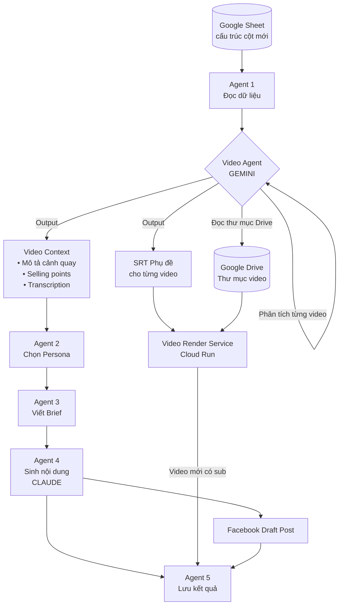
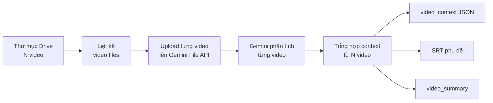
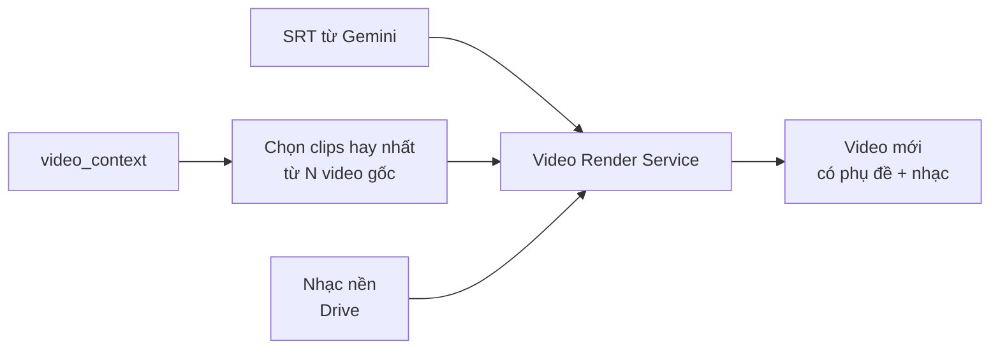
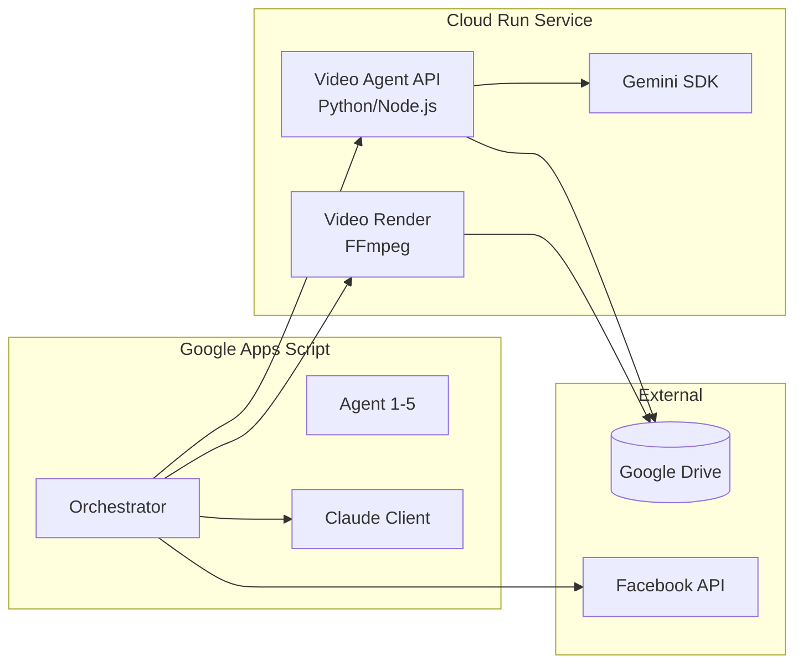

# Thảo luận kiến trúc: Video Pipeline + Cấu trúc cột mới

> [!NOTE]
> Đây là bản thảo luận trước khi code. Mục tiêu: thống nhất hướng đi trước, code sau.

---

## Phần 1: Thay đổi cấu trúc cột Sheet

### Cột mới (thay thế hoàn toàn cột cũ)

| Cột | Bắt buộc? | Mô tả |
|---|---|---|
| `hotel_id` | ✅ Bắt buộc | Mã định danh khách sạn (cũng dùng để map với tên thư mục video trên Drive) |
| `ten_ks` | ✅ Bắt buộc | Tên khách sạn |
| `destination` | ❌ Tuỳ chọn | Địa điểm/vùng miền |
| `gia` | ✅ Bắt buộc | Giá phòng |
| `giai_doan` | ❌ Tuỳ chọn | Giai đoạn chiến dịch (ví dụ: "mùa hè", "Tết", "Black Friday") |
| `benefits_raw` | ❌ Tuỳ chọn | Các ưu đãi/lợi ích dạng text thô |
| `booking_note` | ❌ Tuỳ chọn | Ghi chú đặt phòng, điều kiện đặc biệt |

### Vấn đề: Khi cột tuỳ chọn bị trống, AI lấy gì để viết bài?

Đây là câu hỏi cốt lõi. Có **3 nguồn dữ liệu** để AI dựa vào khi viết bài, xếp theo thứ tự ưu tiên:

```
┌─────────────────────────────────────────────────┐
│  Nguồn 1 (LUÔN CÓ): Dữ liệu cột bắt buộc     │
│  → hotel_id, ten_ks, gia                        │
│  → Đủ để viết 1 bài cơ bản nhất                 │
├─────────────────────────────────────────────────┤
│  Nguồn 2 (NẾU CÓ): Dữ liệu cột tuỳ chọn      │
│  → destination, giai_doan, benefits_raw,         │
│    booking_note                                  │
│  → Làm bài viết phong phú, chi tiết hơn         │
├─────────────────────────────────────────────────┤
│  Nguồn 3 (MỚI — CỐT LÕI): Context từ video    │
│  → AI xem video → bóc tách cảnh quay, tiện ích, │
│    không gian, cảm xúc, điểm bán hàng           │
│  → ĐÂY là nguồn dữ liệu chính thay thế cho     │
│    việc người dùng phải gõ mô tả dài dòng       │
└─────────────────────────────────────────────────┘
```

**Kết luận:** Video chính là "description" mới. Thay vì bắt người dùng gõ mô tả khách sạn (cột `description` cũ), hệ thống sẽ tự "xem" video và hiểu khách sạn có gì. Các cột tuỳ chọn (`benefits_raw`, `booking_note`) chỉ là thông tin bổ sung mà AI không thể nhìn thấy trong video (giá ưu đãi, điều kiện đặt phòng...).

---

## Phần 2: Ai sẽ "xem" video? — Claude vs Gemini

### Claude KHÔNG xem được video

| Khả năng | Claude | Gemini |
|---|---|---|
| Xem video trực tiếp | ❌ Không hỗ trợ | ✅ Native, lên tới 90 phút |
| Phân tích hình ảnh | ✅ Có | ✅ Có |
| Tạo SRT từ video | ❌ Cần tool bên ngoài | ✅ Trực tiếp từ API |
| Gọi từ Apps Script | ✅ Qua REST API | ✅ Qua REST API |
| Chi phí | Cao hơn | Thấp hơn (Flash rất rẻ) |

> [!IMPORTANT]
> **Kết luận: Dùng Gemini làm "Video Agent" chuyên xem video**, còn Claude vẫn giữ vai trò viết nội dung marketing (vì Claude viết tiếng Việt marketing tốt hơn). Đây là kiến trúc **dual-AI** — mỗi AI làm đúng thế mạnh của mình.

### Gemini có thể làm gì với video?

1. **Mô tả chi tiết từng cảnh** — "Cảnh 1: lobby sang trọng với đèn chùm pha lê, nhân viên lễ tân mặc vest..."
2. **Nhận diện tiện ích** — hồ bơi, spa, nhà hàng, phòng gym, view biển...
3. **Trích xuất text trên màn hình** — nếu video có chữ overlay
4. **Nghe và transcribe lời nói** — nếu video có voice-over/narration
5. **Tạo SRT phụ đề** — với timestamp chính xác
6. **Tóm tắt selling points** — "Khách sạn 5 sao, hồ bơi vô cực view biển, buffet hải sản..."

---

## Phần 3: Pipeline mới — Kiến trúc đề xuất

### Sơ đồ tổng quan



### Chi tiết từng bước

#### Bước 0 (MỚI): Video Agent — Gemini phân tích video

```
Input:  Thư mục Drive chứa N video của khách sạn
Output: 
  1. video_context (JSON) — tổng hợp từ tất cả video
  2. srt_content (text) — phụ đề SRT cho video được chọn
  3. video_summary (text ngắn) — tóm tắt 2-3 câu
```

**Flow chi tiết:**



**Cấu trúc `video_context` (output JSON từ Gemini):**

```json
{
  "hotel_id": "H001",
  "total_videos_analyzed": 3,
  "overall_impression": "Resort 5 sao ven biển với phong cách tropical hiện đại",
  "amenities_detected": [
    "Hồ bơi vô cực",
    "Nhà hàng hải sản",
    "Spa & Wellness",
    "Phòng gym"
  ],
  "room_features": [
    "View biển panorama",
    "Ban công riêng",
    "Phòng tắm đá cẩm thạch"
  ],
  "atmosphere": "Sang trọng, yên tĩnh, phù hợp nghỉ dưỡng gia đình hoặc cặp đôi",
  "key_selling_points": [
    "Vị trí đắc địa sát biển",
    "Thiết kế tropical luxury",
    "Buffet hải sản tươi sống"
  ],
  "scenes": [
    {
      "video": "tour_lobby.mp4",
      "timestamp": "00:00-00:15",
      "description": "Lobby rộng với đèn chùm, cây xanh, quầy lễ tân bằng gỗ tự nhiên"
    },
    {
      "video": "pool_drone.mp4",
      "timestamp": "00:00-00:20",
      "description": "Cảnh flycam hồ bơi vô cực, view biển hoàng hôn"
    }
  ],
  "spoken_content_transcript": "Chào mừng quý khách đến với..."
}
```

#### Bước 1-5: Pipeline cũ nhưng dùng `video_context` thay cho `description`

Toàn bộ pipeline Agent 2→3→4 (Claude) giờ nhận thêm `video_context` làm ngữ cảnh chính:

```
System prompt Agent 4 (ví dụ):
─────────────────────────────
Bạn là chuyên gia copywriting khách sạn.

DỮ LIỆU KHÁCH SẠN:
- Tên: {ten_ks}
- Giá: {gia}
- Giai đoạn: {giai_doan}        ← có thể trống
- Ưu đãi: {benefits_raw}       ← có thể trống  
- Ghi chú đặt phòng: {booking_note} ← có thể trống

PHÂN TÍCH TỪ VIDEO (AI đã xem video thực tế):
{video_context}                  ← LUÔN CÓ nếu có video

Viết bài Facebook theo brief sau: {campaign_brief}
```

> [!TIP]
> Khi `benefits_raw` hoặc `booking_note` trống, AI vẫn viết được bài hay vì đã có `video_context` chứa đầy đủ thông tin thị giác về khách sạn. Các cột tuỳ chọn chỉ bổ sung thêm thông tin "phi hình ảnh" mà video không thể hiện (giá giảm, mã voucher, điều kiện huỷ phòng...).

#### Bước phụ: Tạo video mới từ phân tích

Dựa trên kết quả phân tích:



**Có 2 mức độ tạo video mới:**

| Mức | Mô tả | Độ phức tạp | Khuyến nghị |
|---|---|---|---|
| **Mức 1: Đơn giản** | Chọn 1 video gốc tốt nhất → ghép SRT + nhạc nền | Thấp | ✅ Làm trước |
| **Mức 2: Nâng cao** | Cắt clips hay nhất từ N video → ghép thành 1 video mới → thêm SRT + nhạc | Cao | Làm sau |

**Mức 1** dùng được ngay với Video Render Service (Cloud Run) hiện tại — chỉ cần truyền thêm SRT mà Gemini đã tạo.

**Mức 2** cần mở rộng Video Render Service để hỗ trợ:
- Nhận danh sách timestamps cần cắt từ mỗi video
- Cắt + nối các clips bằng FFmpeg
- Ghép SRT + nhạc nền lên video đã nối

---

## Phần 4: Lựa chọn kiến trúc triển khai

### Phương án A: Thuần Google Apps Script

```
Apps Script → gọi Gemini File API trực tiếp → phân tích video
```

**Ưu điểm:** Không cần thêm hạ tầng, mọi thứ nằm trong 1 project.

**Nhược điểm NGHIÊM TRỌNG:**
- ⚠️ Apps Script giới hạn **6 phút/lần chạy** — phân tích 1 video dài có thể mất 2-5 phút, N video sẽ vượt quá
- ⚠️ `UrlFetchApp` giới hạn **50MB/request** — video khách sạn thường > 50MB
- ⚠️ Không thể upload video lớn lên Gemini File API qua Apps Script (cần resumable upload phức tạp)

### Phương án B: Hybrid — Apps Script + Cloud Run (Video Agent)

```
Apps Script (Orchestrator) → gọi Cloud Run (Video Agent) → Cloud Run gọi Gemini
                           → gọi Claude (viết content)
                           → gọi Cloud Run (Video Render)
```



**Ưu điểm:**
- ✅ Cloud Run không giới hạn thời gian chạy (có thể cấu hình tới 60 phút)
- ✅ Xử lý file lớn thoải mái (Gemini File API hỗ trợ tới 20GB)
- ✅ Có thể gộp Video Agent + Video Render vào cùng 1 Cloud Run service
- ✅ Apps Script vẫn là "bộ não" điều phối — giữ nguyên UX cho người vận hành
- ✅ Tận dụng lại Video Render Service đã có

**Nhược điểm:**
- Cần deploy + maintain Cloud Run service
- Cần Gemini API key (miễn phí hoặc trả phí tuỳ lượng dùng)

### Phương án C: Full Cloud Run (bỏ Apps Script)

Chuyển toàn bộ logic sang Cloud Run, Sheet chỉ là database.

**Không khuyến nghị** vì: mất UX "bấm menu trên Sheet", phải xây UI riêng, over-engineering.

---

## Phần 5: Khuyến nghị — Phương án B (Hybrid)

> [!IMPORTANT]
> **Chọn Phương án B** — giữ Apps Script làm Orchestrator + UI, thêm 1 Cloud Run service mới làm "Video Agent" chứa cả Gemini SDK lẫn FFmpeg.

### Pipeline mới hoàn chỉnh (9 bước)

| Bước | Agent | AI Engine | Mô tả |
|---|---|---|---|
| 1 | ReadHotels | — | Đọc dữ liệu từ Sheet (cấu trúc cột mới) |
| 2 | **VideoAgent** | **Gemini** | Đọc thư mục video Drive → phân tích → trả `video_context` + `srt` |
| 3 | BuyerPersona | Claude | Chọn persona (dựa trên cột Sheet + `video_context`) |
| 4 | CampaignBrief | Claude | Viết brief (dựa trên persona + `video_context`) |
| 5 | PlatformContent | Claude | Sinh nội dung Facebook/Zalo (dựa trên brief + `video_context`) |
| 6 | **VideoRender** | FFmpeg | Tạo video mới: chọn video gốc + SRT từ bước 2 + nhạc nền → render |
| 7 | FacebookDraft | — | Tạo draft post trên Facebook (nội dung + video/ảnh) |
| 8 | SaveResults | — | Ghi tất cả kết quả vào Sheet |

### Cấu trúc cột Sheet mới (đầy đủ)

**Input (người dùng điền):**

| Cột | Bắt buộc | Mô tả |
|---|---|---|
| `hotel_id` | ✅ | Mã khách sạn |
| `ten_ks` | ✅ | Tên khách sạn |
| `destination` | ❌ | Địa điểm |
| `gia` | ✅ | Giá phòng |
| `giai_doan` | ❌ | Giai đoạn chiến dịch |
| `benefits_raw` | ❌ | Ưu đãi |
| `booking_note` | ❌ | Ghi chú đặt phòng |
| `video_folder_url` | ✅ | Link thư mục Drive chứa video |
| `music_drive_url` | ❌ | Link nhạc nền (nếu muốn) |

**Output (tự động tạo + điền):**

| Cột | Mô tả |
|---|---|
| `video_context` | JSON tóm tắt nội dung video (từ Gemini) |
| `video_summary` | Tóm tắt ngắn 2-3 câu |
| `buyer_persona` | Persona được chọn |
| `campaign_brief` | Brief chiến dịch |
| `facebook_copy` | Nội dung bài Facebook |
| `zalo_copy` | Nội dung bài Zalo |
| `video_srt` | Nội dung phụ đề SRT |
| `video_render_status` | Trạng thái render video mới |
| `video_render_url` | Link video đã render |
| `fb_post_status` | Trạng thái draft Facebook |
| `status` | Trạng thái tổng (`done`/`error`) |
| `last_run_at` | Thời gian chạy cuối |

---

## Phần 6: Các câu hỏi cần thống nhất trước khi code

> [!WARNING]
> Cần trả lời các câu hỏi sau trước khi bắt tay vào code:

### 1. Về Video Agent (Cloud Run)
- [ ] **Ngôn ngữ:** Python hay Node.js cho Cloud Run service? (Python phổ biến hơn cho AI/video processing)
- [ ] **Gemini model:** Dùng Gemini Flash (nhanh, rẻ) hay Gemini Pro (chính xác hơn)?
- [ ] **Số video tối đa mỗi khách sạn?** (Ảnh hưởng tới thời gian xử lý + chi phí)
- [ ] **Video dài tối đa bao nhiêu phút?**

### 2. Về tạo video mới
- [ ] **Mức 1 hay Mức 2?** Chỉ ghép SRT+nhạc vào 1 video gốc, hay cắt ghép từ nhiều video?
- [ ] **Nếu Mức 2:** Ai quyết định cắt đoạn nào? Gemini tự chọn dựa trên phân tích hay người dùng chỉ định?
- [ ] **Thời lượng video output mong muốn?** (30s? 60s? 90s?)

### 3. Về cấu trúc dữ liệu
- [ ] **`video_folder_url` có bắt buộc không?** Nếu khách sạn không có video thì sao — bỏ qua hay dùng ảnh thay thế?
- [ ] **Cột `drive_folder_url` (ảnh) có còn giữ không?** Hay chỉ dùng video?
- [ ] **`giai_doan`** cụ thể có những giá trị nào? Có ảnh hưởng tới tone/style bài viết không?

### 4. Về chi phí & hạ tầng
- [ ] **Đã có Google Cloud project chưa?** (Cần cho Cloud Run + Gemini API)
- [ ] **Budget cho Gemini API?** Flash rẻ (~$0.075/1M input tokens), Pro đắt hơn (~$1.25/1M)
- [ ] **Video Render Service hiện tại** chạy ở đâu? Có thể gộp Video Agent vào cùng service không?
