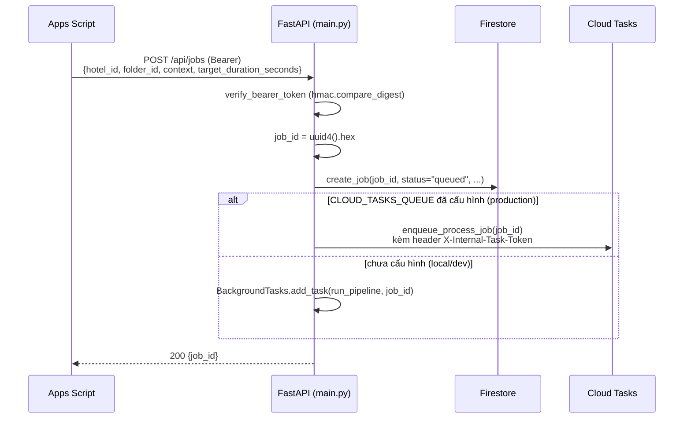
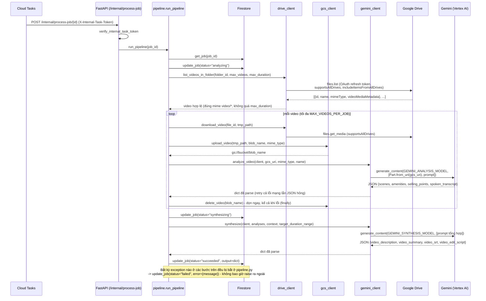
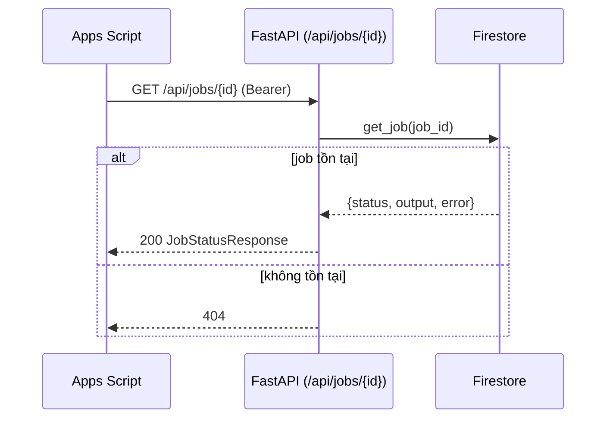
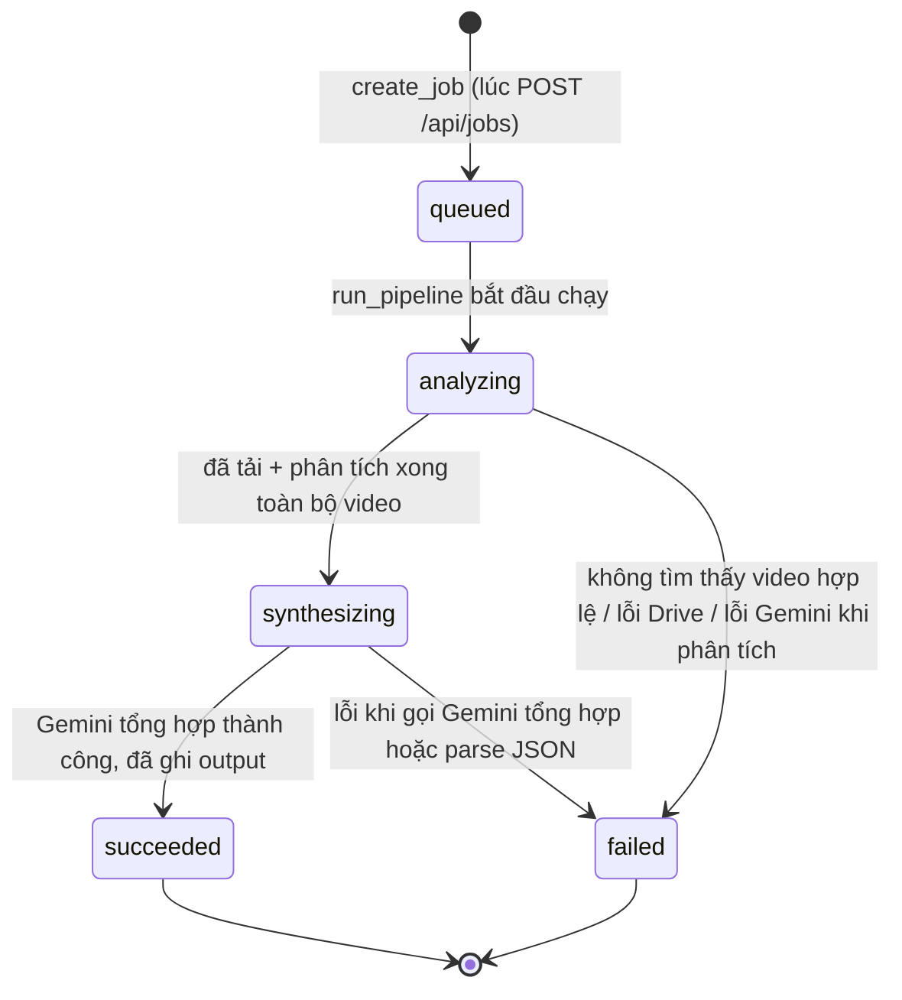

# Kiến trúc chi tiết — Video Agent Service

Cloud Run service (Python + FastAPI) nhận yêu cầu từ Apps Script kèm 1 `folder_id` Drive,
tự đọc toàn bộ video trong thư mục đó bằng OAuth riêng, dùng Gemini (qua **Vertex AI**, billing
dồn về GCP) phân tích từng video rồi tổng hợp thành
`video_description`/`video_summary`/`video_srt`/`video_edit_script`, lưu kết quả vào Firestore để
Apps Script poll lấy về. Bối cảnh rộng hơn (vì sao cần service này, quan hệ với Cloud Run "Video
Render" hiện có) xem [`../PLAN_video_agent_draft.md`](../PLAN_video_agent_draft.md); lý do chuyển
Gemini/Claude sang Vertex AI xem [`../PLAN_vertex_ai_billing_draft.md`](../PLAN_vertex_ai_billing_draft.md).

## Sơ đồ tổng quan (system context)

```mermaid
flowchart LR
  AS["Apps Script<br/>(Orchestrator)"]
  VA[("Video Agent Service<br/>Cloud Run - FastAPI")]
  FS[("Firestore<br/>collection video_agent_jobs")]
  CT[("Cloud Tasks<br/>queue video-agent-jobs")]
  GD[("Google Drive<br/>thư mục video khách sạn")]
  GCS[("GCS bucket<br/>stage video tạm")]
  GA[("Gemini qua Vertex AI<br/>generate_content")]
  VR[("Video Render Service<br/>Cloud Run hiện có")]

  AS -->|"POST /api/jobs, GET /api/jobs/{id}<br/>Bearer API_BEARER_TOKEN"| VA
  VA <-->|đọc/ghi trạng thái job| FS
  VA -->|enqueue| CT
  CT -->|"POST /internal/process-job/{id}<br/>X-Internal-Task-Token"| VA
  VA -->|"OAuth refresh token<br/>scope drive.readonly"| GD
  VA -->|"upload tạm rồi xoá<br/>(Files API không hoạt động ở Vertex AI)"| GCS
  VA -->|"IAM service account<br/>roles/aiplatform.user"| GA
  GA -.đọc video qua Part.from_uri.-> GCS
  AS -.sau khi có video_srt/video_edit_script.-> VR
```

6 thành phần bên ngoài: **Apps Script** (gọi vào, poll kết quả), **Firestore** (lưu trạng thái
job — thay cho việc giữ state trong RAM vì Cloud Run có thể chạy nhiều instance/khởi động lại),
**Cloud Tasks** (đẩy việc xử lý nặng ra khỏi request ban đầu), **Google Drive** (nguồn video),
**GCS** (bãi đáp tạm cho video trước khi gọi Gemini), **Gemini qua Vertex AI** (phân tích + tổng
hợp nội dung, billing chung với toàn bộ GCP thay vì API key riêng).

## Vai trò từng file

| File | Vai trò |
|---|---|
| `app/main.py` | FastAPI app — 4 route: `/health`, `POST /api/jobs`, `GET /api/jobs/{id}`, `POST /internal/process-job/{id}` |
| `app/config.py` | `Settings` (pydantic-settings) đọc toàn bộ cấu hình từ biến môi trường/`.env`, có `get_settings()` cache |
| `app/security.py` | 2 dependency FastAPI: `verify_bearer_token` (cho API công khai), `verify_internal_task_token` (cho endpoint nội bộ) — so sánh bằng `hmac.compare_digest` |
| `app/schemas.py` | Pydantic model request/response: `CreateJobRequest`, `CreateJobResponse`, `JobStatusResponse`, `JobOutput`, `VideoClip` |
| `app/drive_client.py` | Dựng `Credentials` từ OAuth refresh token cố định, liệt kê + tải video trong 1 folder (hỗ trợ Shared Drive qua `supportsAllDrives`) |
| `app/gcs_client.py` | `upload_video()`/`delete_video()` — stage video tạm lên GCS trước khi gọi Gemini (thay Files API, không hoạt động ở chế độ Vertex AI), dọn dẹp ngay sau khi phân tích xong |
| `app/gemini_client.py` | `build_client()` — dựng `genai.Client(vertexai=True, ...)`; `analyze_video()` — phân tích 1 video qua `types.Part.from_uri()` trỏ GCS, model `GEMINI_ANALYSIS_MODEL` (Pro); `synthesize()` — gộp N kết quả phân tích thành output cuối, model `GEMINI_SYNTHESIS_MODEL` (Flash); `_generate_json_with_retry()` retry cả lỗi mạng tạm thời lẫn JSON hỏng |
| `app/pipeline.py` | `run_pipeline(job_id)` — điều phối toàn bộ chuỗi xử lý 1 job: Drive → GCS → Gemini → Firestore, never-throw (mọi lỗi ghi vào `job.error`) |
| `app/firestore_store.py` | `create_job`/`update_job`/`get_job` — CRUD tài liệu job trong Firestore (database riêng `FIRESTORE_DATABASE`, không phải `(default)`) |
| `app/tasks.py` | `enqueue_process_job()` — tạo task Cloud Tasks gọi lại `/internal/process-job/{id}` kèm header xác thực riêng |
| `scripts/get_refresh_token.py` | Script chạy tay 1 lần để lấy `DRIVE_CLIENT_ID`/`SECRET`/`REFRESH_TOKEN` |
| `tests/` | Unit test cho `_extract_json` và validation của schema (không gọi API thật) |
| `Dockerfile`, `docker-compose.yml` | Đóng gói container + test local (xem `README.md`) |

## Luồng 1 — Apps Script tạo job (`POST /api/jobs`)



`job_id` là `uuid4().hex` — không đoán được, nhưng bản thân endpoint `/internal/process-job`
vẫn được khoá riêng bằng `INTERNAL_TASK_TOKEN` (không dựa vào việc job_id khó đoán để bảo mật).

## Luồng 2 — xử lý job (`run_pipeline`, chạy nền qua Cloud Tasks hoặc BackgroundTasks)



Điểm quan trọng:
- **2 lệnh gọi Gemini khác nhau, mỗi lệnh 1 model riêng** — `analyze_video` chạy N lần (1 lần/video)
  bằng `GEMINI_ANALYSIS_MODEL` (mặc định `gemini-2.5-pro` — bản Pro, cần hiểu video tốt nhất);
  `synthesize` chạy đúng **1 lần** ở cuối bằng `GEMINI_SYNTHESIS_MODEL` (mặc định `gemini-2.5-flash`
  — xử lý văn bản thuần từ N kết quả phân tích, không cần lại sức "hiểu video" của Pro). `gemini-3.x`
  đã có trên Vertex AI nhưng project chưa được cấp quyền dùng — xem ghi chú trong `config.py`.
- **Vòng đời GCS object rất ngắn** — upload ngay trước khi gọi Gemini, xoá ngay sau khi phân tích
  xong (dù thành công hay lỗi, nhờ `finally` trong `pipeline.py`) — không tích luỹ storage.
- **Files API (`client.files.upload()`) đã xác nhận KHÔNG hoạt động ở chế độ Vertex AI** (lỗi thật
  gặp phải: `ValueError: This method is only supported in the Gemini Developer client.`) — đây là
  lý do bắt buộc phải có bước GCS ở giữa thay vì upload thẳng như trước.

## Luồng 3 — Apps Script poll kết quả (`GET /api/jobs/{id}`)



Không có cơ chế push/webhook — Apps Script phải tự poll định kỳ (giống hệt pattern
`checkVideoRenderJobs` đã có cho Cloud Run render hiện tại; phần `checkVideoAgentJobs` tương ứng
ở Apps Script chưa code, xem `PLAN_video_agent_draft.md`).

## Vòng đời trạng thái job



`queued` chỉ tồn tại giữa lúc Firestore ghi document và lúc `run_pipeline` thực sự bắt đầu chạy
(qua Cloud Tasks hoặc BackgroundTasks) — thường rất ngắn, nhưng Apps Script vẫn nên coi
`queued`/`analyzing`/`synthesizing` đều là "chưa xong, tiếp tục poll".

## Mô hình xác thực (3 cơ chế độc lập, không dùng chung)

| Kết nối | Cơ chế | Secret / Credential |
|---|---|---|
| Apps Script → `POST/GET /api/jobs*` | Header `Authorization: Bearer <token>` | `API_BEARER_TOKEN` |
| Cloud Tasks → `POST /internal/process-job/{id}` | Header `X-Internal-Task-Token: <token>` | `INTERNAL_TASK_TOKEN` |
| Video Agent Service → Google Drive | OAuth 2.0 refresh token **cố định**, xin quyền 1 lần (không phải service account, không phải token ngắn hạn của Apps Script) | `DRIVE_CLIENT_ID` / `DRIVE_CLIENT_SECRET` / `DRIVE_REFRESH_TOKEN` |
| Video Agent Service → Gemini (Vertex AI) / Firestore / Cloud Tasks / GCS | IAM của service account runtime gắn với chính Cloud Run (không phải secret truyền qua biến môi trường, không còn API key) | service account `video-agent-runtime` — roles cấp project: `datastore.user`, `secretmanager.secretAccessor`, `cloudtasks.enqueuer`, `aiplatform.user`; role cấp bucket: `storage.objectAdmin` trên đúng `GCS_BUCKET` |

Service deploy **public** (`--allow-unauthenticated`) — cố ý không dùng Cloud Run IAM để chặn
truy cập, vì Cloud Run IAM chặn ở mức toàn bộ service (không chặn được riêng từng route), trong
khi `/api/jobs*` cần công khai cho Apps Script gọi qua `UrlFetchApp`. Thay vào đó mỗi nhóm
endpoint tự bảo vệ bằng secret riêng ở tầng ứng dụng — xem lý do chi tiết trong
[`README.md`](README.md#deploy-lên-cloud-run).

## Cấu trúc document Firestore (`video_agent_jobs/{job_id}`)

```json
{
  "hotel_id": "H001",
  "folder_id": "1AbCxyzDriveFolderId",
  "context": {
    "ten_ks": "...", "destination": "...", "gia": "...",
    "giai_doan": "...", "benefits_raw": "...", "booking_note": "..."
  },
  "target_duration_seconds": [30, 60],
  "status": "succeeded",
  "output": {
    "video_description": "Resort 5 sao ven biển...",
    "video_summary": "Tóm tắt 2-3 câu...",
    "video_srt": "1\n00:00:00,000 --> 00:00:04,000\nChào mừng...\n\n2\n...",
    "video_edit_script": [
      {"source_video": "tour_lobby.mp4", "start": "00:15", "end": "00:20"},
      {"source_video": "pool_drone.mp4", "start": "00:05", "end": "00:08"}
    ]
  },
  "error": null,
  "created_at": "2026-08-25T02:53:26Z",
  "updated_at": "2026-08-25T02:54:10Z"
}
```

`context` là bản chụp lại các cột thủ công của khách sạn **tại thời điểm submit** (không đọc lại
Sheet sau đó) — nếu Apps Script sửa cột thủ công sau khi đã submit job, cần submit job mới để
Gemini thấy dữ liệu cập nhật.

## Cấu hình (biến môi trường)

Đầy đủ trong [`.env.example`](.env.example); nhóm theo mục đích:

| Nhóm | Biến | Ghi chú |
|---|---|---|
| Auth công khai | `API_BEARER_TOKEN` | Apps Script dùng để gọi `/api/jobs*` |
| Auth nội bộ | `INTERNAL_TASK_TOKEN` | Chỉ Cloud Tasks biết |
| Gemini (Vertex AI) | `GEMINI_ANALYSIS_MODEL`, `GEMINI_SYNTHESIS_MODEL`, `GEMINI_VERTEX_LOCATION` | mặc định `gemini-2.5-pro` (phân tích) / `gemini-2.5-flash` (tổng hợp) / `us-central1` (gemini-3.x/2.5 KHÔNG có ở `asia-southeast1`) — không còn `GEMINI_API_KEY` |
| GCS | `GCS_BUCKET` | bãi đáp tạm cho video trước khi gọi Gemini, thay Files API |
| Drive OAuth | `DRIVE_CLIENT_ID`, `DRIVE_CLIENT_SECRET`, `DRIVE_REFRESH_TOKEN` | lấy 1 lần bằng `scripts/get_refresh_token.py` |
| Firestore | `GCP_PROJECT_ID`, `FIRESTORE_DATABASE`, `FIRESTORE_COLLECTION` | mặc định database `video-agent-db`, collection `video_agent_jobs` |
| Cloud Tasks | `CLOUD_TASKS_QUEUE`, `CLOUD_TASKS_LOCATION`, `PROCESS_JOB_BASE_URL` | để trống `CLOUD_TASKS_QUEUE` → tự chuyển sang `BackgroundTasks` (dev/local) |
| Giới hạn xử lý | `MAX_VIDEOS_PER_JOB` (10), `MAX_VIDEO_DURATION_SECONDS` (300), `DEFAULT_TARGET_DURATION_MIN/MAX_SECONDS` (30/60) | có thể chỉnh qua env, không hardcode |

## Giới hạn hiện tại (đã biết, chấp nhận có chủ đích)

- **KHÔNG dùng path `/healthz` cho health check** — đã xác nhận bằng test thật trên Cloud Run
  (`bof-intern`): request tới `/healthz` luôn bị chặn ở tầng hạ tầng Google (trả về trang lỗi 404
  của Google, không phải app), không bao giờ tới được container dù các path khác (`/docs`,
  `/api/jobs`, ...) đều hoạt động bình thường. Đã đổi sang `/health`.
- **`_extract_json` dựa trên regex** (`\{.*\}` tham lam, có `re.DOTALL`) để bóc JSON khỏi text
  Gemini trả về — nếu Gemini trả về nhiều khối `{...}` lồng nhau bất thường hoặc text có ký tự
  `}`/`{` nằm ngoài JSON, có thể parse sai. `_generate_json_with_retry` đã retry khi gặp JSON hỏng
  (tối đa 3 lần, đã gặp thật lỗi `"Expecting ',' delimiter"`) nên bớt rủi ro hơn trước, nhưng vẫn
  không phải parser JSON-trong-text tổng quát.
- **`gemini-3.x` (Pro/Flash) đã tồn tại trên Vertex AI Model Garden nhưng project chưa được cấp
  quyền dùng** — test thật trả về 404 "not found or your project does not have access to it" dù
  model có trong danh sách. Đang dùng tạm `gemini-2.5-pro`/`gemini-2.5-flash` (đã xác nhận hoạt
  động), cần enable Gemini 3.x qua Console (Model Garden) giống Claude rồi đổi 2 giá trị
  `GEMINI_ANALYSIS_MODEL`/`GEMINI_SYNTHESIS_MODEL`, không cần sửa code.
- **`GEMINI_VERTEX_LOCATION` phải là region có sẵn Gemini 3.x/2.5** — đã xác nhận `us-central1`
  hoạt động, `asia-southeast1` KHÔNG có các model này trên Vertex AI dù Cloud Run/GCS bucket đặt
  ở đó vẫn bình thường (chỉ riêng lệnh gọi Gemini phải sang region khác).
- **Không giới hạn kích thước video khi tải từ Drive** (chỉ giới hạn theo `durationMillis` nếu
  Drive trả về field đó) — video độ phân giải cao, thời lượng ngắn nhưng dung lượng lớn vẫn lọt
  qua bộ lọc hiện tại; cũng chưa giới hạn kích thước object khi upload lên GCS.
- **`context` không tự đồng bộ lại** với Sheet sau khi job đã submit (xem mục Firestore ở trên) —
  ngoại lệ: `context.video_style_rules` cũng chỉ chụp tại thời điểm submit, xem mục "Văn phong
  video externalize được" bên dưới.
- **Không có cơ chế retry job thất bại tự động** — Apps Script phải tự submit job mới nếu
  `status="failed"`.
- **Cloud Tasks có thể gọi lại `/internal/process-job` cho cùng 1 job ("at-least-once delivery",
  đặc tính đã biết của Cloud Tasks)** — đã gặp thật: 1 job bị gọi 2 lần, lần đầu lỗi
  `400 INVALID_ARGUMENT` (ghi `status=failed`), lần sau mới thành công nhưng field `error` cũ
  không bị xoá, khiến document vừa có `status=succeeded` vừa có `error` — đã fix bằng cách (1)
  `run_pipeline` return sớm nếu job đã ở trạng thái kết thúc (`succeeded`/`failed`), (2) mỗi lần
  ghi trạng thái kết thúc đều xoá tường minh field đối lập (`output=None` khi failed,
  `error=None` khi succeeded). Không loại trừ hoàn toàn 2 lần gọi chạy đồng thời (không có lock
  phân tán), chỉ chặn được trường hợp gọi lại SAU KHI job đã xong.
- **Đã test tích hợp thật với video thật** (không chỉ ảnh test) — chạy qua đúng
  `pipeline.run_pipeline` end-to-end nhiều lần với 1 folder Drive thật nhiều video, ra
  `video_description`/`video_srt`/`video_edit_script` hợp lệ, thời lượng đạt khoảng mục tiêu
  30-60s sau khi nới quy tắc cắt (xem mục "Quy tắc cắt" ở Luồng 2). `tests/` vẫn chỉ test logic
  thuần (`_extract_json`, schema) - không gọi API thật, vì cần credential + folder Drive thật.

## Văn phong video externalize được (không cần sửa code/redeploy)

`gemini_client._DEFAULT_VIDEO_STYLE_RULES` là khối văn phong copywriting mặc định (nguyên tắc
"bán kỳ nghỉ, không giới thiệu khách sạn", 7 tiêu chí phong cách CHV, cụm từ cấm dùng, tone, CTA,
cấu trúc kịch bản tham khảo) dùng cho bước `synthesize()`. Có thể **thay thế toàn bộ** khối này
qua `HotelContext.video_style_rules` trong request `POST /api/jobs` — khi có giá trị, nó thay hẳn
`_DEFAULT_VIDEO_STYLE_RULES` (không phải nối thêm, vì đây là 1 khối hướng dẫn đầy đủ, nối thêm dễ
mâu thuẫn chỉ dẫn).

Phía Apps Script: mô hình dự kiến (khi `VideoAgentClient.gs` được code — **chưa code**, xem
`PLAN_video_agent_draft.md`) là thêm 1 dòng `scope=video_style` vào sheet "Rules" đã có sẵn cho
Facebook/Zalo (`Rules.gs` đã có sẵn `getVideoStyleRules_()` seed + đọc dòng này), rồi gửi kèm giá
trị đó trong `context` khi submit job — người vận hành sửa văn phong ngay trên sheet họ đã quen,
không cần đụng code Cloud Run.
